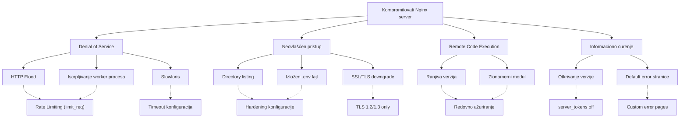

# Analiza napada na Nginx server

Sistem koji se analizira koristi Nginx kao web server. U nastavku je prikazano stablo napada, praktično realizovan napad i analiza ostalih potencijalnih napada.

---

# 1. Stablo napada

---

# 2. Praktično izvršen napad – Iscrpljivanje worker procesa

Napad iscrpljivanja worker procesa realizovan je generisanjem velikog broja paralelnih HTTP zahteva prema serveru. Cilj je bio zauzimanje svih dostupnih konekcija definisanih parametrima `worker_processes` i `worker_connections`.

Tokom eksperimenta primećeno je povećano opterećenje sistema, kao i odbijanje novih zahteva nakon dostizanja limita konekcija. Time je demonstrirano da nepravilna konfiguracija može dovesti do nedostupnosti servisa legitimnim korisnicima.

Ovaj napad pripada kategoriji Denial of Service napada i pokazuje značaj pravilnog podešavanja parametara i mehanizama ograničenja zahteva.

***Mitigacija*** 
Neki od vidova mitigacije ovog problema je setiranje limit_req ili povećanjem broja worker_connections ako performanse servera to dozvoljavaju.

---

# 3. Napadi koji nisu realizovani

U nastavku su detaljnije opisani napadi identifikovani u stablu napada koji nisu praktično izvedeni tokom eksperimenta, ali predstavljaju realne bezbednosne rizike u slučaju nepravilne konfiguracije ili održavanja sistema.

---

## HTTP Flood

HTTP Flood podrazumeva slanje velikog broja legitimnih HTTP zahteva sa ciljem preopterećenja servera. Za razliku od klasičnih mrežnih DoS napada, ovde su zahtevi sintaksno ispravni i teško ih je razlikovati od regularnog korisničkog saobraćaja. Napad se često realizuje korišćenjem distribuiranih izvora (botnet), čime se dodatno otežava filtriranje i blokiranje napadača.

Posledica uspešnog HTTP Flood napada je povećano opterećenje CPU i memorijskih resursa, kao i degradacija performansi aplikacije. Efikasne mere zaštite uključuju rate limiting, korišćenje reverse proxy zaštite, Web Application Firewall (WAF) mehanizama i implementaciju sistema za detekciju anomalija u saobraćaju.

---

## Slowloris

Slowloris napad se zasniva na održavanju velikog broja otvorenih konekcija uz veoma sporo slanje HTTP zaglavlja. Time se zauzimaju dostupni konekcioni slotovi servera bez generisanja velikog mrežnog saobraćaja, što napad čini teže uočljivim u poređenju sa klasičnim DoS tehnikama.

Ukoliko timeout parametri nisu adekvatno podešeni, server može ostati bez raspoloživih resursa za obradu legitimnih zahteva. Zaštita se postiže pravilnom konfiguracijom parametara kao što su `client_header_timeout`, `client_body_timeout` i ograničavanjem maksimalnog broja simultanih konekcija po klijentu.

---

## Directory listing

Omogućena opcija prikaza sadržaja direktorijuma (`autoindex on`) može napadaču pružiti detaljan uvid u strukturu aplikacije, raspored fajlova i eventualno prisustvo backup ili konfiguracionih datoteka. Iako sama po sebi ne predstavlja direktnu kompromitaciju, značajno olakšava dalju analizu sistema.

Napadač može iskoristiti ove informacije za planiranje ciljanih napada, identifikaciju skrivenih endpoint-a ili preuzimanje osetljivih fajlova koji nisu namenjeni javnom pristupu. Onemogućavanje directory listing opcije i striktno definisanje root direktorijuma predstavljaju osnovne mere zaštite.

---

## Izložen .env fajl

Ukoliko se `.env` fajl nalazi u javno dostupnom direktorijumu i nije pravilno zaštićen, može postati direktno dostupan putem HTTP zahteva. Ovakav fajl često sadrži poverljive informacije kao što su kredencijali baze podataka, API ključevi, tajni tokeni i drugi bezbednosno osetljivi podaci.

Eksploatacija ove ranjivosti može dovesti do potpune kompromitacije aplikacije i povezanih servisa. Preporučena praksa podrazumeva čuvanje konfiguracionih fajlova van javnog direktorijuma, korišćenje varijabli okruženja na nivou sistema i dodatno ograničavanje pristupa putem pravilno definisanih Nginx pravila.

---

## SSL/TLS downgrade

SSL/TLS downgrade napad pokušava da primora komunikaciju između klijenta i servera na korišćenje zastarele i kriptografski slabije verzije protokola. Starije verzije TLS-a mogu sadržati poznate ranjivosti koje omogućavaju presretanje ili manipulaciju saobraćajem.

Ukoliko server podržava zastarele protokole (npr. TLS 1.0 ili 1.1), napadač može pokušati da iskoristi slabosti u tim implementacijama. Ograničavanje podrške isključivo na TLS 1.2 i TLS 1.3, zajedno sa pravilno podešenim cipher suite-ovima, predstavlja efikasnu preventivnu meru.

---

## Ranjiva verzija

Korišćenje zastarele verzije Nginx servera može omogućiti eksploataciju javno poznatih bezbednosnih propusta (CVE ranjivosti). Napadači često automatizovano skeniraju servere u potrazi za verzijama koje sadrže dokumentovane slabosti.

Redovno ažuriranje softvera, praćenje bezbednosnih biltena i primena zakrpa predstavljaju osnovni deo bezbednosne politike. Zanemarivanje ovih aktivnosti značajno povećava rizik od kompromitacije sistema.

---

## Zlonamerni modul

Instalacija neproverenih ili nesigurnih Nginx modula može uvesti dodatne ranjivosti u sistem. Budući da moduli imaju direktan pristup procesima servera, eventualne greške u njihovoj implementaciji mogu omogućiti izvršavanje zlonamernog koda ili eskalaciju privilegija.

Preporučuje se korišćenje isključivo zvaničnih i dobro održavanih modula, kao i testiranje dodataka u kontrolisanom okruženju pre implementacije u produkciji. Princip minimalne funkcionalnosti (instalirati samo ono što je neophodno) dodatno smanjuje napadnu površinu sistema.

---

## Otkrivanje verzije

Prikazivanje verzije servera u HTTP zaglavlju ili na podrazumevanim stranicama može napadaču olakšati identifikaciju potencijalnih ranjivosti specifičnih za tu verziju softvera. Ova informacija može poslužiti kao početna tačka za ciljane napade.

Iako samo otkrivanje verzije ne predstavlja direktnu ranjivost, smanjuje nivo anonimnosti sistema i olakšava izviđanje (reconnaissance) fazu napada. Onemogućavanje prikaza verzije putem direktive `server_tokens off` predstavlja jednostavnu, ali korisnu meru zaštite.

---

## Default error stranice

Podrazumevane Nginx error stranice mogu sadržati tehničke detalje o konfiguraciji servera ili strukturi aplikacije. Ove informacije mogu pomoći napadaču u razumevanju infrastrukture i identifikaciji potencijalnih tačaka napada.

Korišćenje prilagođenih (custom) error stranica smanjuje količinu dostupnih informacija i doprinosi profesionalnijem izgledu sistema. Ova mera ne eliminiše napad, ali predstavlja deo strategije smanjenja izloženih informacija (information disclosure minimization).