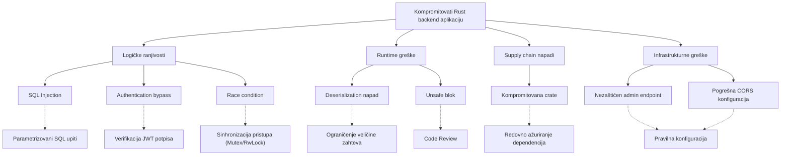

# Analiza napada na Rust backend aplikaciju

Analizirani sistem koristi backend implementiran u programskom jeziku Rust. U nastavku je prikazano stablo napada, praktično realizovan napad i analiza ostalih potencijalnih napada.

---

# 1. Stablo napada

# 2. Race condition

Race condition nastaje kada više paralelnih zahteva pristupa deljenim resursima bez adekvatne sinhronizacije, što može dovesti do nekonzistentnog ili neočekivanog stanja sistema. Iako Rust na nivou tip sistema sprečava klasične data race situacije, logičke race condition ranjivosti su i dalje moguće u aplikativnom kodu.

***Mitigacija*** 
Pravilna upotreba mehanizama sinhronizacije poput `Mutex`, `RwLock` ili atomskih tipova, kao i pažljivo dizajniranje transakcionih operacija, ključni su za sprečavanje ovakvih problema.

---

# 3. Napadi koji nisu realizovani

U nastavku su detaljnije opisani napadi identifikovani u stablu napada koji nisu praktično izvedeni tokom eksperimenta, ali predstavljaju realne bezbednosne rizike u produkcionom okruženju.

---

## SQL Injection

SQL Injection predstavlja napad u kome napadač ubacuje maliciozni SQL kod kroz korisnički unos sa ciljem manipulacije bazom podataka. Iako Rust kao jezik eliminiše čitavu klasu memory-based ranjivosti, logičke greške u formiranju SQL upita i dalje mogu dovesti do ozbiljnih posledica.

Ukoliko se SQL upiti konstrušu dinamičkim spajanjem stringova, napadač može izmeniti strukturu upita i dobiti neovlašćen pristup podacima, izbrisati zapise ili eskalirati privilegije. Upotreba parametrizovanih upita i ORM alata koji podržavaju bind parametre predstavlja standardnu i efikasnu meru zaštite.

---

## Authentication bypass

Authentication bypass podrazumeva zaobilaženje mehanizma autentifikacije, najčešće manipulacijom JWT tokena ili neadekvatnom proverom potpisa i roka važenja. Ukoliko backend ne verifikuje potpis tokena ili prihvata neispravne algoritme, napadač može generisati sopstveni token sa proizvoljnim privilegijama.

Posledica ovakve ranjivosti je neovlašćen pristup zaštićenim resursima i potencijalna kompromitacija celokupnog sistema. Pravilna validacija potpisa, algoritma, issuer-a i expiration polja predstavlja obaveznu bezbednosnu praksu.

---

## Deserialization napad

Deserialization napad podrazumeva slanje specijalno konstruisanog ili prevelikog JSON payload-a koji može izazvati preopterećenje sistema, povećanu potrošnju memorije ili logičke greške prilikom parsiranja. U web aplikacijama ovo se često manifestuje kao Denial of Service napad.

Ukoliko backend nema ograničenje veličine zahteva ili validaciju strukture podataka, napadač može izazvati degradaciju performansi ili pad aplikacije. Implementacija ograničenja veličine zahteva i striktna validacija input-a predstavljaju osnovne mere zaštite.

---

## Unsafe blok

Korišćenje `unsafe` bloka u Rust-u omogućava zaobilaženje bezbednosnih garancija jezika, uključujući proveru pozajmljivanja i thread-safety mehanizme. Iako je `unsafe` ponekad neophodan za niskonivojske operacije, nepravilna upotreba može dovesti do memory corruption, data race situacija ili undefined behavior-a.

U bezbednosnom kontekstu, `unsafe` kod povećava napadnu površinu sistema jer eliminiše deo zaštite koju Rust pruža na nivou kompajlera. Preporučuje se minimalna i strogo kontrolisana upotreba, uz detaljne code review procedure.

---

## Kompromitovani crate

Supply chain napadi podrazumevaju kompromitovanje biblioteka (crate) koje aplikacija koristi. Ukoliko napadač ubaci zlonamerni kod u popularnu biblioteku ili kompromituje njen distribucioni kanal, aplikacije koje je koriste mogu nesvesno postati deo napada.

Ovakvi napadi su posebno opasni jer se maliciozni kod izvršava unutar legitimne aplikacije. Redovno korišćenje alata poput `cargo audit`, praćenje bezbednosnih obaveštenja i zaključavanje verzija dependencija (`Cargo.lock`) smanjuju ovaj rizik.

---

## Nezaštićen admin endpoint

Administrativni endpoint bez adekvatne autentifikacije i autorizacije predstavlja jednu od najkritičnijih infrastrukturnih ranjivosti. Ukoliko napadač dobije pristup administrativnim funkcijama, može izvršiti izmene konfiguracije, obrisati podatke ili kompromitovati ceo sistem.

Implementacija stroge kontrole pristupa, role-based autorizacije i dodatnih mehanizama zaštite (npr. IP ograničenja ili dodatne autentifikacije) predstavlja osnovnu bezbednosnu praksu.

---

## Pogrešna CORS konfiguracija

Nepravilno podešen CORS može omogućiti izvršavanje zahteva sa neproverenih ili zlonamernih domena. Ukoliko backend dozvoljava pristup sa bilo kog izvora (`*`) u kombinaciji sa kredencijalima, povećava se rizik od krađe tokena ili CSRF napada.

Precizno definisanje dozvoljenih domena, HTTP metoda i zaglavlja smanjuje napadnu površinu i predstavlja važan deo bezbednosne konfiguracije web aplikacija.